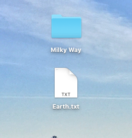
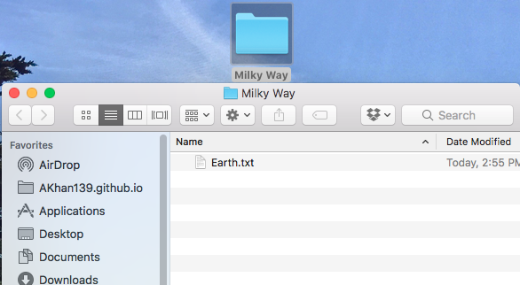
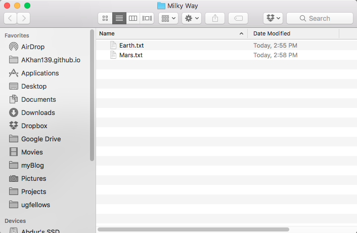
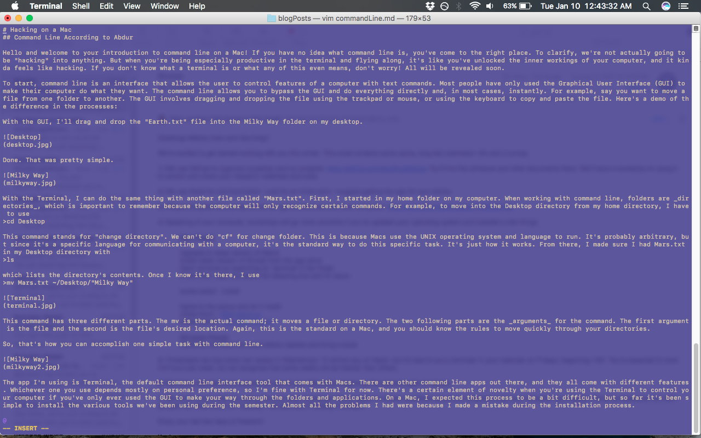

# Hacking on a Mac
## Command Line According to Abdur

Hello and welcome to your introduction to command line on a Mac! If you have no idea what command line is, you've come to the right place. To clarify, we're not actually going to be "hacking" into anything. But when you're being especially productive in the terminal and flying along, it's like you've unlocked the inner workings of your computer, and it kinda feels like hacking. If you don't know what a terminal is or what any of this even means, don't worry! All will be revealed soon.

To start, command line is an interface that allows the user to control features of a computer with text commands. Most people have only used the Graphical User Interface (GUI) to make their computer do what they want. The command line allows you to bypass the GUI and do everything directly and, in most cases, instantly. For example, say you want to move a file from one folder to another. The GUI involves dragging and dropping the file using the trackpad or mouse, or using the keyboard to copy and paste the file. Here's a demo of the difference in the processes:

With the GUI, I'll drag and drop the "Earth.txt" file into the Milky Way folder on my desktop.

Done. That was pretty simple. 

With the Terminal, I can do the same thing with another file called "Mars.txt". First, I started in my home folder on my computer. When working with command line, folders are _directories_, which is important to remember because the computer will only recognize certain commands. For example, to move into the Desktop directory from my home directory, I have to use 
>$ cd Desktop

This command stands for "change directory". We can't do "cf" for change folder. This is because Macs use the UNIX operating system and language to run. It's probably arbitrary, but since it's a specific language for communicating with a computer, it's the standard way to do this specific task. It's just how it works. From there, I made sure I had Mars.txt in my Desktop directory with 
>$ ls

which lists the directory's contents. Once I know it's there, I use 
>$ mv Mars.txt ~/Desktop/"Milky Way"

![Terminal]
(terminal.jpg)

This command has three different parts. The mv is the actual command; it moves a file or directory. The two following parts are the _arguments_ for the command. The first argument is the file and the second is the file's desired location. Again, this is the standard on a Mac, and you should know the rules to move quickly through your directories. 

So, that's how you can accomplish one simple task with command line. 

The app I'm using is Terminal, the default command line interface tool that comes with Macs. There are other command line apps out there, and they all come with different features. Whichever one you use depends mostly on personal preference, so I'm fine with Terminal for now. There's a certain element of novelty when you're using the Terminal to control your computer if you've only ever used the GUI to make your way through the folders and applications. On a Mac, I expected this process to be a bit difficult, but so far it's been simple to install the various tools we've been using during the semester. Almost all the problems I had were because I made a mistake during the installation process. 

However, there are a few reasons that computers these days are designed for GUI use. The main reason is user-friendliness. Command line can be clunky, especially if you're new to it and are [learning on your own](https://learnrubythehardway.org/book/appendixa.html "Learn Command Line the Hard Way"). Commands aren't always obvious and it takes some getting used. It's a powerful tool once you know what you're doing but first you have to learn. I was fortunate to have learned the basics of UNIX in my Intro to Programming class during my junior year. Coming armed with that knowledge of how to navigate directories and files meant I just had to relearn all the commands instead of memorizing them from scratch. Brandon made a very useful [command line quiz](https://bmw9t.github.io/command_line_browser_quiz/ "Command line quiz") that made the process even simpler. Of course, you don't need to worry if some keywords fall through the cracks because it's easy to look anything up, but command line is all about speed and knowing everything in your head makes it that much easier. The commands are intuitive once you get to know a few of them, and most of the time if you forget one, you can guess what it is.

Speaking of making it easier, one of the the most interesting parts of command line (to me) is Vim. Vim is an incredibly basic text editor that's included in Terminal. For many people, it's faster to open a .txt file or a .md file in Sublime or Atom instead of using Vim. I usually work with Terminal and a Safari window in full screen together so opening another application's window means I can't see my resources while I work on a file. For me it's faster to open the file in Vim and edit it right there in Terminal rather than switch to a different text editing app. It took a while to learn because it is not intuitive at all, but once you get the hang of it, it's a useful tool for basic files of code or text. You'll probably hate it, and that's fine! I know I'm in the minority when I say I like it, so I get it. All this is deeply customizable; you can change everything about your Terminal, or iTerm, or whichever app you use for command line tools. The beauty of command line is that because you're not using the GUI, you aren't restricted in what you can do on your computer, so you can also change everything about your computer if you want. To give you some insight, here's a screenshot of my customized Terminal with Vim open on this blog post. 

I told you that command line was fun, but I'm sure all of this may not sound all that fun to you. That's ok! The fun part comes now: Github. Aidan wrote a post about Github from his perspective which you should read to get an idea of how it works on a PC. There are some differences in getting it to work, but the process is the same. Github consists of repositories for mainly code but all sorts of data can be hosted on it. For example, the original code used to launch Apollo 11 is hosted in a [repository](https://github.com/chrislgarry/Apollo-11 "Original Apollo 11 code") on Github for anyone to look at. Github uses Git, a sort of programming language but simpler, to communicate with computers. After developing a long document of code or a blog post, you'll have to _push_ it to our Github repository. I had to look up how to do it the first few times, but the process is extremely satisfying. It's fun to work on a project on your computer and instantly see it on the internet as soon as you're done. I'll be writing another post about Github soon, so don't worry about the details just yet.

Hopefully this provided some insight on how command line and Terminal work on Macs. The resources linked in the post should help on your journey through learning all about command line tools, and if not, feel free to email/Slack me if you'd like. Happy hacking!
